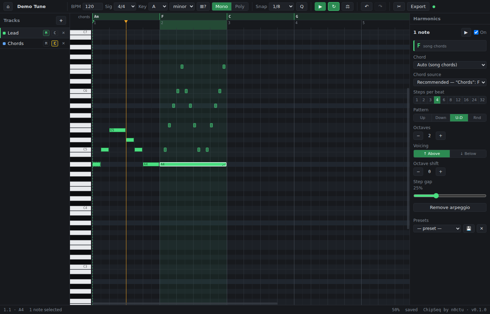

# ChipSeq

**n0ctus chiptune sequencer for Arduino, Flipper Zero, MCUs and more**

A purely browser-based chiptune sequencer with badge-accurate square-wave
preview and a non-destructive arpeggiator. Born for an ESP-driven event badge,
it exports to Arduino-style `.h` note arrays, Flipper Zero `.fmf` files, and
`.wav`. No build step, no dependencies - plain HTML/CSS/JS with native ES
modules.



## Run it

```sh
node dev-server.mjs           # from this directory
# open http://localhost:8000
```

Any static file server works (the app uses ES modules, so `file://` won't),
but prefer this one while developing: it sends `Cache-Control: no-store`.

That matters more than it sounds. The tool cards load lazily, so
`import('./instrument.js')` runs when a card is first expanded - *after* the
page has finished loading. A hard reload bypasses the cache for the
navigation and everything fetched during it, but a later runtime import is an
ordinary fetch obeying the ordinary cache. `python3 -m http.server` sends no
`Cache-Control` at all, so the browser falls back to heuristic caching from
`Last-Modified` and can hand you a stale tool card while the statically
imported core around it is already up to date. The app then looks broken
rather than stale, which is a genuinely nasty thing to debug.

In production the same shape exists with a shorter fuse: Pages serves JS with
`cache-control: max-age=600`, so a visitor could hold a fresh `main.js` beside
a tool card from the previous release. Every `load()` in the tool manifest
therefore carries `?v=${APP_VERSION}` - `main.js` is what supplies the version
string, so the moment it is fresh, every module it lazily asks for is too.
It's a fully static site - GitHub Pages serves it as-is.

## Releasing

Pushes to `main` do **not** publish. Tags do:

```sh
git tag v0.2.0 && git push origin v0.2.0
```

Before tagging, bump `APP_VERSION` in `js/core/version.js` and add the matching
`## [x.y.z]` section to `CHANGELOG.md`. The workflow checks all three agree and
fails the release if they do not - a site that announces a version nobody can
find in the history is worse than a late release.

`.github/workflows/pages.yml` runs the unit, module-import and golden suites,
checks the tag against `APP_VERSION` and the changelog, and then deploys. Branch-based publishing was dropped because Pages runs one deployment
at a time per repository: a burst of pushes queues up, and each deploy step
aborts itself after ~10 minutes of waiting. The workflow sets
`cancel-in-progress`, so a newer release supersedes an older one instead of
both dying. `workflow_dispatch` republishes without minting a tag.

## Modes

- **Mono** - one voice, badge-accurate square-wave preview, exports a `.h`
  header (`{NOTE_E4, 80}` entries, rests as `{NOTE_REST, ms}`) or a Flipper
  Zero `.fmf` file (RTTTL-style: note lengths quantized to 1/1…1/128 incl.
  dotted, rests as `P`; anything rounded is listed in the export warnings).
  Overlapping notes are flagged red (press `N` to cycle, status bar offers
  Auto-fix); mono exports are blocked until they're resolved.
- **Poly** - multiple tracks with instruments, exports `.wav`. Besides the
  square / sine / sawtooth presets, the **Instrument** tool (always in the
  sidebar, editing the active track) sets wave (incl. triangle and PWM with
  duty cycle), full ADSR envelope and gain. Edits make
  the track "Custom" until saved as a named preset, which then appears in
  every track's picker and travels in the project file.

## Automation lanes (poly)

Below the piano roll, every control of the active track's instrument gets its
own expandable **Automation** lane: Gain, Attack, Decay, Sustain, Release -
plus Duty for PWM instruments. Gain starts expanded (baseline 100%); the rest
sit collapsed as slim read-only previews and expand on click (clicking a
collapsed lane never edits anything). In an expanded lane: click adds a
keyframe, drag moves it, double-click cycles the curve (step / linear /
ease), right-click deletes. Levels read as percentages, where 0% is silence
and 100% is unity - the gain lane goes to 150%, with a dashed "100%" line
marking unity and any keyframe above it drawn in the warning colour, because
that is where the master limiter starts working. ADSR/duty values are
absolute overrides of the instrument's setting (dashed baseline = the
current value); values are
sampled per note event - every arp step reads the curve independently, so
fast arps become smooth sweeps - and held notes get true intra-note gain
ramps. Poly-only; mono and the `.h`/`.fmf` exports ignore automation
entirely.

## Levels (polyphony normalization)

Voices sum linearly, so with the default instrument gain **three simultaneous
notes already reach the limiter's knee** - a polyphonic sequencer that starts
distorting on the fourth note is mis-calibrated. Measured on the shipped
demos, Tetris and Bad Apple had been running about +5 dB into the limiter
since they were made.

The **Levels** card fixes it by scaling voices by `N^-k` in two stages, where
N is how many voices are sounding:

- **track** - how many voices does *this* track have right now? Balances a
  chord against a single note within one instrument.
- **song** - how many are sounding *anywhere* right now? Balances the whole
  arrangement against a solo passage.

`k` is the dial: `0` is off (voices sum, as before), `0.5` is equal power
(four voices are twice one voice, not four times) and `1` is constant sum (a
chord is exactly as loud as one note). A single global "turn it down" number
was rejected deliberately - it makes a sparse melody quiet to accommodate one
dense bar elsewhere. Because the factor follows what is actually sounding, a
solo passage has N=1 and is multiplied by exactly 1.

A voice **holds its final gain value through its release**, so that value is
taken from the level the note actually had - sampled a whole grid cell inside
the note, and floored by the last few milliseconds rather than read at a
single instant. Both matter: 0.1 ms of backoff rounded into the same 5 ms
cell as the note's end, where simultaneous notes had already stopped being
counted, and smoothing eases the factor back toward 1 before a note is over.
Together they made a ducked chord release at 2.5x its own level.

A track can be **excluded** from Levels entirely (the checkboxes in the card,
stored as `track.normalize = false`). Excluded means excluded from *both*
stages: the voice plays at exactly the level it was written at and carries no
moving gain, while the rest of the arrangement still normalizes around it.
That is what you want for a lead - it used to cancel only the track stage,
which for a monophonic lead was indistinguishable from doing nothing, because
the song stage kept riding it anyway. Setting a **number** instead (`0`..`1`)
overrides just that track's own exponent and keeps the song stage, so `0` is
still available for the old meaning.

**Smoothing** is the other dial and it matters more than it looks: the factor
changes in steps, and a step in gain is a click, but too much smoothing lets
short dense hits through. Bad Apple's notes run 18-109 ms, and 30 ms of
smoothing let a six-voice stack back over full scale where 10 ms held it
under. The card shows the predicted peak with and without normalization so a
setting can be judged by number as well as by ear.

All of it is a pure function of the flattened score, so it is deterministic
and preview still equals export. **Mono is never touched** - one voice has
nothing to normalize - which is what keeps `.h`/`.fmf` and the badge-accurate
preview out of reach of any of it.

## Mixing

Every track gets its own node in the audio graph - `buildGraph` in
`js/core/graph.js`, called identically by playback and the WAV renderer - so
per-track **gain** and **pan** are audio operations rather than numbers baked
into each voice. The **Mixer** card in the sidebar edits both (gain as a
percentage, pan as `L50`/`C`/`R100`), plus **solo**.

### Two gain stages, and which one to reach for

`instrument.gain` is the instrument's own level, and the presets are
calibrated against each other so a sine and a saw sit at a similar loudness.
`track.gain` in the **Mixer** is where a track is balanced against the others.

Reach for the **Mixer** to mix. The Instrument tool's Gain is part of the
sound's design, and changing it makes the track Custom - which is why the
control now says so underneath itself rather than only in here.

A **reset to default** link appears beside the percentage - and only while
the gain has drifted from the level its wave was calibrated at (square 35%,
sine 50%, sawtooth 35%; anything else follows the square). At the calibrated
level there is nothing to reset, so neither the link nor the explanation
under the slider is drawn. It reads the built-in presets rather than the
document's own, so a project whose stored gains have drifted still resets to
the right number instead of back to whatever it drifted to.

Editing any instrument parameter is **copy-on-write**: it writes an inline
`track.instrument` and never modifies the shared preset, so a preset used by
three tracks stays put when one of them is edited. The gain lane multiplies
on top of both, so a lane at 100% with the track at 80% is 80%.

**Pan** also exists as an automation lane, so a voice can sweep across the
field over time - the classic ping-pong. A lane overrides the track's static
pan (the same rule every other lane follows), and because position then
changes per event, each voice carries its own panner instead of sharing the
track's; the Mixer's pan slider stands down and reads `lane`.

**Spread** fans the tracks out in one click - melody centred, the rest
alternating outward - as a starting point you then adjust. A MIDI import of
more than two tracks into a poly project gets the same treatment, so a
multi-track file arrives sounding like an arrangement rather than a mush
stacked dead centre.

Exports go stereo **only when something is actually panned**; an unpanned
project renders the same mono file it always did. The export dialog says
which it will be and why (`Output: stereo - 2 of 4 tracks panned`), with a
**Force stereo** checkbox for when you want two channels regardless - the
hint there used to claim "mono mix" unconditionally, which stopped being true
the moment panning shipped. A `StereoPannerNode` is likewise only inserted
when it will do something, because at pan 0 it still applies the -3 dB centre
law - downmixed into a mono render, that would have made every unpanned
export quietly 3 dB quieter.

Mute and solo stay *flatten-time* filters rather than becoming node gains:
routing a muted track through a zero-gain node would mean scheduling and
rendering audio nobody can hear - 5650 notes of it in the Bad Apple demo - to
save a re-flatten that costs nothing. Solo beats mute-by-omission, and mono
ignores all of it: the melody track is the voice, which is what keeps `.h` and
`.fmf` out of reach of the mixer entirely.

## Envelopes and modulation

There used to be two systems for "a value that moves over time" - ADSR
(note-relative, gain only, rendered as Web Audio ramps) and automation lanes
(song-absolute, sampled per event) - and because ramps and
`setValueCurveAtTime` cannot share an `AudioParam`, gain automation needed a
**second gain node**. That node was the tell: two things were being combined
in the node *graph* when they should be combined in the *value* domain.

`js/core/modulation.js` does the multiplying, so a voice now uses **one gain
node**. Two paths, chosen by whether anything actually varies:

- **ramps** - only the envelope moves and it is ADSR-shaped. Scheduled as
  exact Web Audio ramps, so the badge's 2 ms attack lands on the sample it
  should. This is the common case, and it is bit-for-bit what it always was.
- **curve** - a gain lane varies across the note, or the envelope was drawn
  freehand. Instrument gain x envelope x lane are sampled together
  into one array covering the whole voice, release tail included. Sampling is
  by *time* (0.5 ms), not by a fixed points-per-note budget, because the
  latter smears a 2 ms attack away on any note longer than a second.

### Velocity is stored, not applied

Every note carries a `velocity`, and MIDI import fills it in from the file -
Rickroll arrives with 48 distinct values spanning 2 to 100. It is preserved
through every edit, save and export, and it is **deliberately not applied to
the sound**.

Nothing in the UI shows or edits it, so a note sitting 3 dB below its
neighbours looks identical to them with nothing on screen to explain why -
which is indistinguishable from a bug. Until there is a velocity editor,
every note sounds at the nominal value (`NOMINAL_VELOCITY = 100`, the value
notes written in the app already carry, so ignoring velocity moves the notes
that *deviate* rather than shifting everything 2.1 dB).

Two places must agree on this, and share one constant so they cannot drift:
the voice in `instruments.js` and the peak estimate in `normalize.js`. An
estimate that disagreed with what is rendered would warn about clipping that
cannot happen, or miss clipping that can. Re-enabling velocity is a one-line
change in each, plus a UI.

The **envelope** is one shape with two editors. The four ADSR sliders drive it
while it stays ADSR-shaped; drag a point on the canvas into something they
cannot express and the shape is stored explicitly as
`instrument.env = {kind:'env', v:1, points, sustainIndex, timeBase:'sec'}` -
following the extension-block rule, so no migration - and the sliders grey out
rather than rounding your curve back into four numbers. "Reset to ADSR" drops
the block and the sliders come back exactly as they were. Points up to the
sustain index are measured from note onset; the rest are measured from note
off. A note shorter than its own attack releases from wherever it actually
got to, not from a sustain level it never reached.

The four ADSR **automation lanes are unchanged** - they still override
a/d/s/r per event, now by feeding the envelope generator instead of a parallel
code path.

`note.detune` (cents) and `note.lfo` are live targets, which is what makes
vibrato and portamento data rather than deferred features; only the editing UI
is missing.

## Tracks

Rows are **reorderable** - drag a track from anywhere on it. The drag arms on
mousedown and only begins once the pointer has moved a few pixels, so a plain
click still selects the track and a double-click still opens the dialog;
buttons and the instrument menu keep their own gestures. Past the threshold
the click is swallowed, so a drag is one undo entry rather than a reorder
plus a track switch.
Order is presentational (playback reads whichever tracks are playable and
sorts events by tick), but it does decide the palette position of any track
that has not picked a colour.

Double-clicking a track's name opens the **Track** dialog: name and colour
together, since those are the two things you change about a track as an
object. Every track carries a colour explicitly, assigned at birth from the
least-used entry - deriving it from row position was tidy until rows could be
reordered, at which point every colour shuffled whenever the list did. An
identity that moves is not an identity.

`track.color` is one field in **two forms**:

```jsonc
"color": 6          // palette index 0..7, resolved through the theme
"color": "#ff8800"  // a literal colour, used verbatim
```

An index keeps the look retunable from `css/base.css` (and will follow a light
theme, if one ever lands); a hex covers anything the palette does not, and is
there to be hand-edited. Both are the *same field*, so the two can never drift
apart the way an index plus a mirrored hex would - and every view resolves it
through the same pair of helpers, `trackColor()` for canvas and
`trackColorCss()` for inline styles. Shorthand (`#f80`) works. A string that
does not parse as a hex is ignored, and the dialog leaves the existing colour
alone rather than storing a typo.

### Mute and solo

They answer different questions, and the difference is deliberate:

| | sounds | in the grid | counted by Levels |
|---|---|---|---|
| **mute** | no | hidden | **no** - it is not part of the piece |
| **solo** | only soloed tracks | others stay visible, drawn faint | **yes, unchanged** |

Solo not touching Levels is the point of it: a soloed track previews at the
level it has *in the mix*, which is the only level worth judging it at. If
soloing changed the level, you would be auditioning something you never
actually hear. Mute is the opposite - a muted track leaves the piece, so the
others get its headroom back.

Several tracks can be soloed at once and play together. Mute beats solo:
soloing a track you have muted does not unmute it, and if the only soloed
track is muted then nothing is really soloed. The track you are editing stays
visible even when muted, so muting it never makes it uneditable.

## The project file

Projects are `.chipseq.json` - the compound extension is deliberate. It keeps
the `.json` suffix, so editors syntax-highlight and validate it, `jq` works on
it and GitHub renders it in the browser, which matters for a tool whose pitch
is plain files and no build step. A short custom extension would have bought
three characters and cost all of that, and being a web app there is no OS file
association to claim anyway. Older `.tune.json` files still open - the picker
matches on `.json`, and the in-file format id never changed.

Saved with every project, so reopening puts you exactly where you left off:
the loop region, snap/grid preference, active track, **scroll position, zoom
level and cursor position**. The view is a self-versioned block that is
deliberately *not* declared in `doc.uses` - a reader that ignores it still
plays the file correctly, which is the bar for belonging in that list.
Scrolling never pushes an undo entry and never triggers a save on its own; it
rides along with the next save, or with the flush when you leave the tab.

## Growing the file format

Three rules keep `.chipseq.json` extensible without breaking files. The point of
all three: a build that meets a file it does not fully understand must still
open it, say what it cannot honour, and - above all - not quietly destroy the
parts it could not read.

One caveat about direction. A **v3 build refuses a v4 file outright**: its
validator predates these rules and throws on any newer version. That is fixed
from v4 on - `validate()` now opens a newer file and lets `doc.uses` explain
what is missing - so the guarantee holds going forward, not backward.

1. **Extension blocks are namespaced and self-versioned.** Anything a feature
   owns lives in its own object carrying `kind` and `v`, e.g.
   `master.limiter = {kind:'limiter', v:1, ceilingDb:-0.1}`. A block evolves on
   its own `v`; `SCHEMA_VERSION` is bumped only for renames or changed meaning,
   never for additions (which default on load).
2. **Unknown keys are preserved verbatim.** `migrate()` mutates the parsed JSON
   instead of rebuilding a document from known fields, so a block this build has
   never heard of survives load-and-save untouched. Never reconstruct a document
   field-by-field - that is what silently drops a newer build's data.
3. **`doc.uses` declares what a reader must understand**, e.g.
   `['harmonics','automation','tempoMap']`. Meeting an entry it does not know,
   a build says so - "this project uses X, which this version can't play; it is
   preserved, not lost" - instead of playing the file wrong in silence. Entries
   this build cannot evaluate are carried over rather than recomputed away.

`tests/golden.mjs` pins all three.

### Tempo and meter are maps

`song.tempo` is `[{tick, bpm}]` and `song.meter` is `[{tick, num, den}]`, even
though the editing UI only ever writes one entry. Everything reads them through
`bpmAt` / `timeSigAt` / `tickToSeconds` / `secondsToTick`, and `tickToSeconds`
integrates across entries - so adding mid-song tempo changes is a UI job, not a
rewrite of the engine and all four exporters. MIDI import already keeps whole
maps instead of discarding tempo changes with a warning.

`song.bpm` and `song.timeSig` remain as **derived mirrors** of the first map
entry, doing two jobs: a future build that restructures the maps can still find
a tempo in a file written here, and this build can still find one in that
file - `bpmAt`/`timeSigAt` fall back to the scalars when the maps are missing.
`syncLegacyFields` recomputes them; the maps are always authoritative.

A multi-entry map is declared in `doc.uses` precisely because a reader that
falls back to the mirror plays one tempo throughout - which sounds fine and is
wrong, the worst kind of failure.

## Integrity and resilience

**Every id in the document names something that exists.** `enforceInvariants`
runs inside the store on every commit, project open, undo and redo, so
"well-formed" is a property of every snapshot rather than something each call
site has to remember - deleting a track just deletes the track, and the
active/melody/chord markers are re-pointed for it. Orphaned instrument
references fall back to Square, a track-less or instrument-less project is
given the minimum back, and `chordTrackId` stays a soft reference that may be
null. Only *actual* repairs are reported (via `doc-repaired`, shown in the
status bar), so a healthy project is never touched and the pass can run
constantly without becoming noise.

Deliberately not enforced: a **muted melody track**. It is a legitimate thing
to do, and moving the M marker in response would repeat an annoyance that was
already reported once - markers do not wander on their own.

**Storage can fail at any moment, and the editor does not care.** Private
modes and restricted iframes throw `SecurityError` on the first access; a full
quota throws `QuotaExceededError` on a write that used to work. Every
localStorage access goes through wrappers in `js/core/persist.js` that never
throw: on failure the app degrades to an in-memory store, keeps the open
project fully editable for the rest of the session, and the status bar says
`not saving - storage is full` (a persistent message, not a flash - every later
edit is also not being saved). It never deletes another project to make room,
and a corrupt entry reads as absent rather than throwing into the boot path.

## Output level

Playback and the `.wav` exporter share one output stage (`js/core/graph.js`),
so what you hear is what you get - they used to differ, with exports rendering
about 1 dB hotter than the preview because only the engine applied the master
gain.

That stage ends in a soft clipper, so the downmix can never leave the master
above 0 dBFS: below -3 dBFS it is exactly transparent, above that it bends
smoothly toward a -0.1 dBFS ceiling. A stateless `WaveShaper` is used rather
than a compressor precisely because it behaves identically in realtime and
offline rendering.

Because a limited mix still *sounds* clean, the level is also reported: the
export dialog shows the peak and warns when the mix only fit because it was
shaped ("Mix peaks at +3.2 dB…"), and the status bar flags playback that goes
over. Both read the peak *before* the clipper, which is the number you need to
act on. The limiter is stored per project as
`master.limiter = {kind, v, enabled, ceilingDb, kneeDb}`; there is no UI switch
yet, but the data supports one.

## The tools sidebar (and how to add a tool)

Each tool is a **collapsible card**, boxed so it is obvious where one starts
and what belongs to it. A card **opens itself when its tool is actually in
play and stays closed when it is not** - select a note carrying an arpeggio
and Harmonics opens; select a plain one and it waits, showing `1 note`. The
status indicator is drawn for collapsed cards too: that is its main job, so a
closed card still tells you whether the tool is in effect.

Fold state is tri-state. Absent means *auto* (follow the tool's own status);
an explicit click is **sticky** from then on, because a card someone
deliberately closed must not spring back open every time the selection
changes. `reset` in the panel header returns everything to auto.

**Adding a tool is one file plus one manifest entry.** `js/ui/tools/manifest.js`
declares each tool with four things:

| | |
|---|---|
| `when(ctx)` | is it applicable at all? `false` hides the card |
| `status(ctx)` | `{on, label}` for the indicator - **cheap and pure** |
| `load()` | the only dynamic `import()`, run on first expand |
| `id`, `name` | identity; ids are asserted unique at load |

`status()` deliberately lives in the manifest rather than the tool module,
because it runs for *collapsed* cards - answering it must not require loading
anything. `js/ui/tools-panel.js` imports no tool at all: it builds every card
from the manifest and calls `tool.load()` the first time a card opens, so a
tool you never touch is never fetched, parsed or wired up. The tool module
itself only exports `mount(host, ctx)` and fills the card body.

Nothing looks a tool up by string - the panel iterates the array - so a typo
is a missing card at load time rather than a card that silently renders
nothing, and `tests/check.mjs` imports every `load()` target so a broken tool
fails CI instead of at runtime.

The tools themselves: **Harmonics** (below), **Transpose** - bulk pitch moves,
±1 octave, ±1 semitone, ±1 *scale degree* (stays in the song key), plus "snap
chromatic notes to key" for cleanup after imports or key changes - and
**Instrument** (poly), which edits the active track and is therefore always
present: collapsed while the track uses a stock Square/Sine/Saw, opening
itself once the sound is fine-tuned into a Custom config or switched to a
saved preset. A track's instrument picker focuses that track and reveals the
card for the session, without pinning it open for good.

## Arpeggios (the fun part)

Select a note → right panel. The arpeggio is stored **on** the note
(non-destructive): tweak or remove it anytime, the original note stays.
Configure steps/beat, pattern (up / down / up-down / random), octave range,
per-step gap and chord (Auto song-chords / Auto diatonic / major / minor /
power / sus4 / octaves). Save configs as presets to reapply quickly.

The panel always shows **which chord the arp resolved to and why** (e.g.
"Am - song chords", or a yellow warning when a fallback kicked in), and the
▶ button auditions the selected note's arp. By default chords are stacked
upward from the note like FamiTracker's `0xy` effect - if the note isn't a
chord tone, the sweep uses only the chord's tones above it (no semitone
clusters). The **Voicing** control flips the chord below the note (the note
becomes the top tone - the classic shape for bass accompaniment), and
**Octave shift** transposes the whole sweep ±3 octaves, e.g. to imitate a
bass chords part without moving the note out of the melody register.

"Auto (song chords)" follows the track marked as *chords* - but that mark is
only a **recommendation**, not a lock-in. Every arp gets a "Chord source"
menu, ordered by familiarity: the recommended track first, then the chord
any *other* track implies at that position, then quality chords (major,
minor, power, 7ths … the more exotic, the further down), and finally "Pick
notes…" - a 12-key picker for arbitrary chords. Track sources stay live
(edit the track and the arps follow); presets never store source info.

Use the **M**/**C** buttons in the track list to pick the melody and chords
tracks in any mode (right-clicking a track also toggles chords). The M marker
is independent of the highlighted row: clicking a row only changes which
track you're viewing/editing - what plays in mono moves only when you click
M. The panels
are resizable by dragging their inner edge (double-click resets). Chord
tracks are analyzed like a DAW chord track: each chord **holds until the
next one**, staccato hits and broken/arpeggiated figures resolve to their
full chord per bar. With no chords track (or before the first chord) it
falls back to the song key; chromatic notes get the key mode's triad
quality - every fallback is spelled out in the panel.

## MIDI import

Drop a `.mid` file anywhere to start a **new project** from it. To pull tracks
**into the project you're working on**, use the music-note button next to "+"
in the tracks panel: the same assignment dialog appears, but the chosen tracks
are appended - song settings, existing tracks and the melody marker stay put,
and colliding names get a numbered suffix. Notes keep their musical positions,
so a file with a different tempo simply plays at the project's BPM (the dialog
warns when they differ).

Drop a `.mid` file anywhere. Every MIDI instrument (each channel in each
chunk) becomes its own track, labeled with its General MIDI program name.
You then assign each one a role (melody / chords / muted / skip) - the app
pre-suggests them: lead-like instruments become the melody, piano/organ/guitar
comping is preferred over pads and ambience for the chords role, and drums are
skipped. BPM, time signature and key are taken from the file; if the file has
no key-signature event, the key is guessed from the notes (and marked as a
guess). The ♪? button next to the Key selector re-runs that detection on the
current song at any time.

## Files

- Projects autosave to localStorage on every change (recent list on the start
  screen). `Export → .chipseq.json` gives a portable project file; everything in
  it stays editable, including applied arpeggios.
- Opening the app resumes the project you last had open, with the piano roll
  centred on the active track's notes (mono badge tunes sit high, so the
  default view would cut them off).
- **Demos** get their own section on the start page and are loaded fresh from
  `demos/` on every visit, so updates always reach everyone - they are never
  copied into your storage. Open one to explore it; the moment you edit, a
  personal copy with the same name is created and the demo stays pristine.
  Add your own by dropping a `.chipseq.json` into `demos/` and listing it in
  `demos/index.json` - that list is also the display order. Shipped: "Demo Mono" (arpeggios), "Demo Poly"
  (automation lanes: PWM duty sweep, intra-note gain swell, stepped-gain
  echoes, release change), "Rickroll", "Tetris" and "Bad Apple".
- The export dialog can restrict `.h`/`.wav` output to the **loop region**
  (checkbox, shown with its bar range). Region exports keep leading/trailing
  rests and are cut to the exact region length, so they loop seamlessly on
  the badge and in samplers.

## Keyboard (excerpt)

| Keys | Action |
|---|---|
| `Space` / `Shift+Space` | play/stop (always from the placed cursor) - pause/resume in place |
| Arrows / `Shift+Arrows` | move cursor - move/transpose selection |
| `Alt+←/→` | resize selection |
| `Enter` / `Delete` | add-or-select note - delete selection |
| `Tab` | next note, `Ctrl+A` select all |
| `Ctrl+Z/Y` `Ctrl+C/X/V/D` | undo/redo, clipboard, duplicate |
| `1`-`6`, `7`, `0` | snap 1/1…1/32 - triplet - off |
| `Q` | quantize selection |
| `L` `M` `N` | loop - metronome - next conflict |
| `Ctrl+Shift+[` / `]` | trim before / after cursor |
| `Ctrl+E` | export |

Click the ruler to place the cursor (green marker - `Space` always starts
there; right-click offers "Reset cursor to start"); drag on it for a loop
region, right-click for loop/trim options. The loop region is part of the
project - it survives reloads and travels in `.chipseq.json` files, as does
the snap/grid preference.
In the grid: plain drag marquee-selects, a plain click just moves the cursor.
`Shift+drag` draws a note from start to release (snapped; `Alt` for freeform),
`Shift+click` adds one at the last-used length. Right-click deletes notes
(drag to sweep-erase); `Alt+drag` duplicates. Wheel scrolls through time,
`Shift+wheel` scrolls pitch, `Ctrl+wheel` zooms, middle-drag pans.

## Tests

No frameworks here either - plain Node scripts in `tests/` (Node 22+):

```sh
node tests/unit.mjs        # core-logic tests (arps, chords, exporters, MIDI, migrations, limiter)
node tests/check.mjs       # imports every ES module to catch syntax errors
node tests/golden.mjs      # byte-compares exporter + pipeline output against fixtures
node tests/smoke.mjs       # browser tests driving the real UI headlessly
node tests/live-check.mjs  # verifies a deployed instance (defaults to the GitHub Pages URL)
```

The browser suites need a Chromium binary - they auto-detect Playwright's
cache and common system paths, or set `CHROME_BIN=/path/to/chrome`.

`golden.mjs` is the regression net for "preview = export = badge": it pins the
migrated document, the flattened event stream and the `.h`/`.fmf` text for
every shipped demo, plus a determinism check (the same document must always
flatten identically) and a forward-compatibility check (unknown blocks in a
`.chipseq.json` survive a load/save round-trip untouched). Artifacts over 32 kB
are stored as a hash with head/tail context instead of in full. After a
*deliberate* output change, regenerate with `node tests/golden.mjs --update`
and review the diff in its own commit - never inside a feature commit, or an
unintended change can hide in the noise.

Rendered audio is deliberately not byte-compared: `WaveShaper` behaviour
varies between Chromium builds, so the browser suite asserts peak, RMS,
duration and RIFF structure instead.

## Hacking

- `js/core/` - engine, no DOM: document model (`doc.js`), snapshot undo
  (`store.js`), the harmonics/arp renderer (`harmonics.js`), the single flatten pipeline
  (`flatten.js`, shared by playback/wav/h/ghosts), Web Audio engine, MIDI
  parser, exporters.
- `js/ui/` - screens, canvas piano roll, panels. UI talks to core only via
  the store; core never touches the DOM.
- `js/ui/tools/` - one file per sidebar tool, each exporting `mount(host, ctx)`,
  plus `manifest.js` which declares them. Adding a tool means adding a file and
  a manifest entry - nothing else in the app has to know it exists.
- Theme: edit the custom properties in `css/base.css` - the canvases read
  them too.
- Console handle: `window.__chipseq` exposes `{store, uiStore, engine}`.
